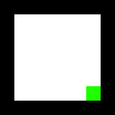

# Environment Modication Basics

## Environment Template

The static section of the environment is currently stored in a png image file,
this is used as a basis for the dynamic elements of the environment.

### Example

The below environment is simply a square with the with the end goal and
starting position (this may be overridden in some instances)

> Please do not use this as a starting point as it has been scaled so that it
> is actually visible, [env1.png](../blue_ai/envs/env1.png) for a actual template
> if needed

### Color Mappings

[^1]: [color mappings](https://github.com/echalmers/blue_ai/blob/HEAD/blue_ai/envs/transient_goals.py#L197)
[^2]: [color classifacition](https://github.com/echalmers/blue_ai/blob/HEAD/blue_ai/envs/color_classifier.py)

| RGB Color[^1] | Name    | Object[^2]                                                      |
| :------------ | :------ | :-------------------------------------------------------------- |
| (0, 0, 0)     | Black   | Impenetrable barrier                                            |
| (255, 0, 0)   | Red     | Lava                                                            |
| (0, 255, 0)   | Green   | Endpoint                                                        |
| (0, 0, 255)   | Blue    | Hard Coded Small Reward                                         |
| (255, 255, 0) | Yellow  | Safe Area, no other obstacles or rewards will be generated here |
| (0, 255, 255) | Cyan    | _Not Yet Assigned_                                              |
| (255, 0, 255) | Magenta | _Not Yet Assigned_                                              |
